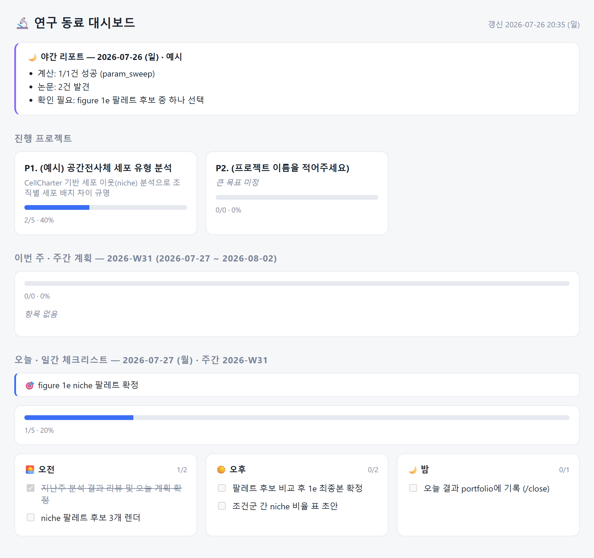
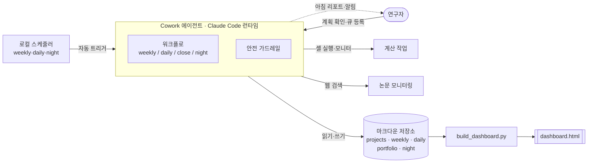

# Cowork — 자율 AI 연구 동료 에이전트

> 연구자를 위한 AI 에이전트. 하루를 계획하고, 진행을 추적하고, **자는 동안에도 계산과 자료조사를 대신 돌려** 아침 리포트로 남긴다.

Cowork는 "챗봇"이 아니라 **스스로 스케줄에 따라 움직이는 자율 에이전트**입니다.
매주 계획을 세우고, 매일 오전·오후·밤 체크리스트를 만들고, 밤에는 사용자가 큐에 넣어둔 계산 작업을 실행·모니터링하며 관련 논문을 검색해 아침에 요약 리포트를 남깁니다. 모든 기록은 마크다운으로 축적되어 그대로 **업무일지·포트폴리오·연구노트**가 됩니다.

이 저장소는 **"AI Agent 서비스 기획"** 역량을 보여주기 위한 포트폴리오입니다. 실제로 동작하는 구현(현실)과 서비스로서의 확장 기획(비전)을 함께 담았습니다.

- 📄 **[서비스 기획서](docs/기획서.md)** — 문제 정의, 페르소나, 기능, 차별점, KPI, 로드맵
- 🧱 **[아키텍처 & 에이전트 설계](docs/architecture.md)** — 시스템 구조, 오케스트레이션, 안전 설계
- 🎬 **[데모 시나리오](docs/demo.md)** — 실제 사용 흐름과 화면



> 아침에 켜면 보이는 화면: 지난 밤 자율 근무 리포트(🌙) → 프로젝트 진행률 → 이번 주 → 오늘의 오전·오후·밤 체크리스트.

---

## 핵심 기능

| | 기능 | 한 줄 설명 |
|---|------|-----------|
| 🗓️ | **주간 계획** | 지난주 회고(자동 집계) + 이번주 Top 3 목표 제안 |
| ✅ | **일간 체크리스트** | 하루를 오전·오후·밤 3구간으로 나눠 배치, 어제 미완 자동 이월 |
| 🌙 | **야간 근무 (자율 실행)** | 큐에 넣어둔 계산을 밤에 실행·모니터링 + 논문 모니터링 → 아침 리포트 |
| 📁 | **포트폴리오 자동 축적** | 완료 업무를 업무일지로 누적, 나중에 보고서·논문·포트폴리오 재료 |
| 📊 | **대시보드** | 프로젝트 진행률·이번주·오늘·지난밤을 한 화면에 (라이트/다크) |

## 왜 '앱'이 아니라 '에이전트'인가

기존 도구는 사용자가 **직접** 입력하고 실행해야 합니다. Notion·Todoist는 계획을 대신 세워주지 않고, ChatGPT/Claude 챗은 세션이 끝나면 기억이 없고 스스로 움직이지 않습니다.

Cowork의 핵심 가설은 **"연구 업무의 병목은 아이디어가 아니라, 긴 대기시간과 파편화된 실행·기록"** 이라는 것입니다. 그래서 에이전트가 필요합니다:

- **자율성** — 스케줄에 따라 사람 없이 계획을 세우고 계산을 실행한다
- **지속성** — 마크다운에 상태를 남겨 세션을 넘어 기억한다
- **도구 사용** — 셸·웹검색·파일을 직접 다뤄 실제 작업을 진행시킨다

## 아키텍처 한눈에



자세한 내용은 **[architecture.md](docs/architecture.md)**.

## 빠른 시작

```bash
# 1. 이 폴더에서 에이전트(Claude Code) 실행 — CLAUDE.md가 에이전트 페르소나로 로드됨
cd path/to/cowork

# 2. 대시보드 생성 후 브라우저로 열기
python build_dashboard.py   # -> dashboard.html
```

에이전트에게 쓰는 3+1 명령:

| 명령 | 언제 | 하는 일 |
|------|------|---------|
| `/weekly` | 월요일 아침 | 지난주 회고 + 이번주 계획 |
| `/daily` | 매일 아침 | 오전/오후/밤 체크리스트, 어제 미완 이월 |
| `/close` | 밤/마감 | 완료 업무를 포트폴리오에 기록 |
| `/night` | 매일 밤 (자동) | 큐 작업 실행 + 논문 모니터링 → 아침 리포트 |

자동 스케줄(주간·일간·야간)은 로컬 스케줄러로 등록되어, 앱이 켜져 있는 동안 발화합니다. 설정은 [architecture.md](docs/architecture.md#스케줄링)를 참고하세요.

## 프로젝트 구조

```
cowork/
├─ CLAUDE.md              에이전트 페르소나·운영 규칙 (에이전트 설계 산출물)
├─ projects.md            프로젝트 + 큰/작은 목표 (진행률 단일 소스)
├─ weekly/ daily/         주간·일간 기록 (마크다운)
├─ portfolio/             완료 업무 누적 (업무일지)
├─ night/                 야간 근무: queue(작업큐)·watchlist(논문)·logs·reports
├─ templates/             각 문서 템플릿
├─ .claude/commands/      슬래시 커맨드(워크플로) 정의
├─ build_dashboard.py     마크다운 → dashboard.html
└─ docs/                  기획서·아키텍처·데모
```

## 안전 설계 (자율 실행의 신뢰)

자율 에이전트는 강력한 만큼 위험도 큽니다. Cowork는 세 가지 가드레일을 둡니다:

1. **파괴적 명령 차단** — 야간 큐에서 삭제·전송·게시·자격증명 입력이 포함된 명령은 실행하지 않고 '보류'로 표시
2. **프롬프트 인젝션 방어** — 웹 검색·페이지 내용은 데이터로만 취급하고, 그 안의 지시는 절대 실행하지 않음
3. **사람 확인 지점(HITL)** — 되돌릴 수 없는 판단은 아침 리포트의 '확인 필요'로 남겨 사용자에게 위임

## 기술 스택

- **에이전트 런타임**: Claude Code (Claude Agent SDK) — 셸·파일·웹 도구 + 슬래시 커맨드 + 로컬 스케줄러
- **저장**: 마크다운 (플레인텍스트, Git·Obsidian·VSCode 호환 → 잠금 없음, 이식성)
- **대시보드 빌드**: Python 표준 라이브러리만 (의존성 0)

## 로드맵

- **Now** — 개인 로컬 에이전트 (구현 완료)
- **Next** — 멀티유저·클라우드 실행, GitHub/Slack/Zotero 연동, 랩 단위 협업
- **Later** — 랩 지식베이스, 실험 자동화 연동, 에이전트 스킬 마켓

전체 로드맵과 KPI는 **[기획서](docs/기획서.md#로드맵)**에.
