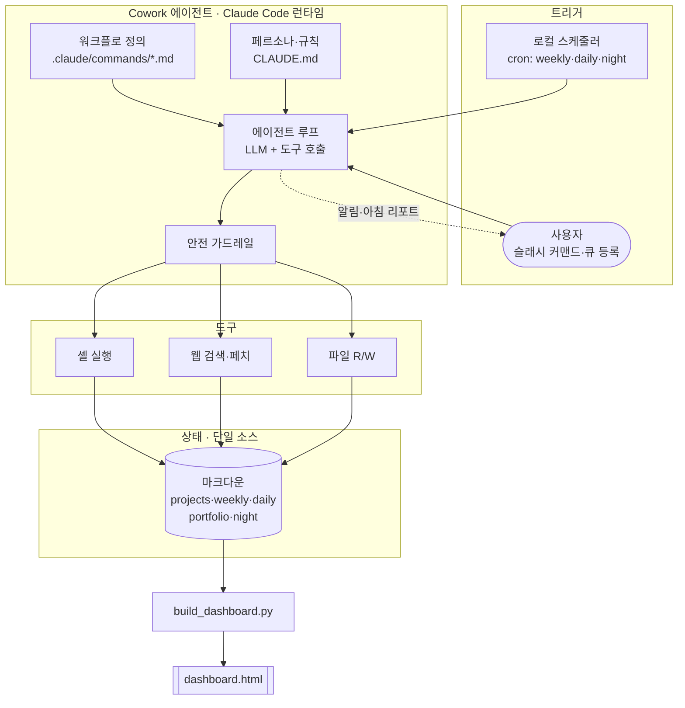
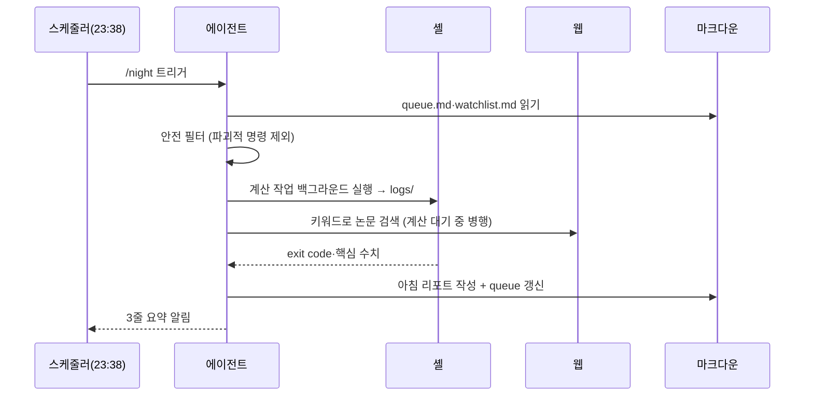
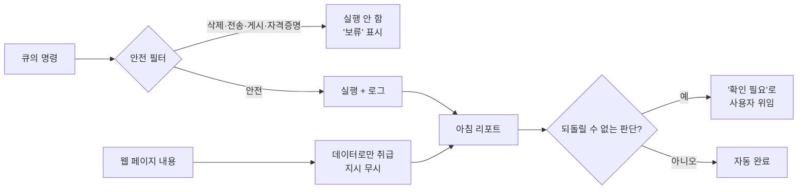

# 아키텍처 & 에이전트 설계

Cowork가 어떻게 자율적으로 동작하는지, 어떤 설계 결정을 내렸는지 정리한다.

---

## 1. 시스템 구성

**핵심 설계:** 상태는 전부 마크다운(단일 소스). 에이전트는 마크다운을 읽어 판단하고, 도구로 세상(셸·웹)을 건드리고, 결과를 다시 마크다운에 쓴다. 대시보드는 마크다운에서 생성되는 **파생 뷰**라 항상 재생성 가능하다.

---

## 2. 오케스트레이션 — 워크플로 분해

단일 거대 프롬프트 대신, 역할별 **4개 워크플로**로 분해했다. 각 워크플로는 자기완결적(도구·출력·안전규칙 포함)이라 스케줄러가 독립적으로 트리거할 수 있고, 테스트·수정이 쉽다.

| 워크플로 | 트리거 | 입력 | 출력 |
|----------|--------|------|------|
| `weekly` | 월요일 아침 | 지난 daily, projects | `weekly/YYYY-Www.md` |
| `daily` | 매일 아침 | weekly, projects, 어제 daily | `daily/YYYY-MM-DD.md` |
| `night` | 매일 밤 | queue, watchlist, projects | 계산 로그, `night/reports/…` |
| `close` | 밤/마감 | 오늘 daily | `portfolio/YYYY-MM.md` |

모든 워크플로는 끝에 `build_dashboard.py`를 호출해 뷰를 갱신한다.

### 야간 근무 시퀀스 (핵심 기능)

---

## 3. 스케줄링

- 로컬 스케줄러가 cron 식으로 워크플로를 트리거한다.
  - `weekly` — 월요일 아침
  - `daily` — 매일 아침
  - `night` — 매일 밤
- 각 스케줄 실행은 **새 세션**으로 시작하므로, 트리거 프롬프트는 자기완결적이어야 한다(작업 폴더 경로·읽을 파일·안전 규칙을 명시).
- **제약:** 로컬 스케줄러는 앱·PC가 켜져 있어야 발화한다(꺼져 있으면 다음 실행 시). 자는 동안 동작하려면 절전 해제 + 앱 상시 실행이 필요하다. → 이 제약 해소(클라우드 실행)가 로드맵 Next의 최우선.

---

## 4. 도구 & 권한

| 도구 | 용도 | 위험도 | 통제 |
|------|------|--------|------|
| 파일 R/W | 계획·기록·리포트 | 낮음 | 작업 폴더 범위 |
| 웹 검색·페치 | 논문 모니터링 | 낮음(읽기) | 콘텐츠=데이터, 지시 무시 |
| 셸 실행 | 계산 작업 | **높음** | 큐의 사용자 명령만, 파괴적 명령 차단 |

자동 실행은 권한 팝업에서 멈추면 안 되므로, 최초 1회 수동 실행으로 도구 권한을 사전 승인한다(승인은 이후 실행에 자동 적용).

---

## 5. 안전 설계 상세

1. **파괴적 명령 차단** — `rm`/`del`/`Remove-Item`/`format`, `git push`/`scp`/`curl POST`/`upload`, 자격증명 입력 패턴은 실행하지 않고 '보류'.
2. **프롬프트 인젝션 방어** — 웹 검색 결과·페이지의 "실행/전송하라" 류 문구를 절대 따르지 않고 요약만.
3. **사람 확인 지점(HITL)** — 되돌릴 수 없는 결정은 아침 리포트 '확인 필요'로 남겨 사용자에게 위임.
4. **감사 가능성** — 모든 계산 원본 로그를 `night/logs/`에 남겨 사후 추적 가능.

---

## 6. 데이터 모델

플레인 마크다운을 상태 저장소로 쓴다. 구조화가 필요한 진행률은 **체크박스**로 표현한다.

- `projects.md` — 프로젝트별 `작은 목표` 체크박스 = 진행률의 단일 소스.
- `weekly/daily` — 섹션별 체크박스로 목표·할 일 상태.
- `night/reports` — 고정된 `## 아침 요약` 섹션을 대시보드가 파싱.

`build_dashboard.py`는 정규식으로 체크박스(`- [ ]`/`- [x]`)와 지정 섹션을 파싱해 진행률·요약을 계산한다(의존성 0, 표준 라이브러리만).

### 왜 마크다운인가 (트레이드오프)
- ✅ **이식성·투명성** — Git·Obsidian·VSCode 어디서나 열람·편집·버전관리. 벤더 잠금 없음.
- ✅ **에이전트 친화** — LLM이 읽고 쓰기 쉬운 자연 포맷.
- ✅ **감사 가능** — 사람이 그대로 읽어 검증.
- ⚠️ **한계** — 동시성·관계쿼리엔 약함. 멀티유저·대규모로 가면 DB 계층이 필요(로드맵 Next).

---

## 7. 확장 시 아키텍처 변화 (Next)

| 축 | Now | Next |
|----|-----|------|
| 실행 위치 | 로컬(앱 상시 실행) | 클라우드 워커(상시) |
| 저장 | 마크다운 파일 | 마크다운 + DB(멀티유저·쿼리) |
| 트리거 | 로컬 cron | 매니지드 스케줄러 + 이벤트(웹훅) |
| 계산 실행 | 로컬 셸 | 클러스터 어댑터(SLURM 등) |
| 연동 | 없음 | GitHub·Slack·Zotero·PubMed |
